# Organisation logos

Each logo file is the property of its respective organisation. Used here for identification
and informational purposes under fair dealing / fair use provisions, except where a file is
sourced from Wikimedia Commons under an open license (marked below).

This table is auto-generated by `util/check_logo.py` from `docs/assets/org-logos/sources.json`
— don't hand-edit the table below, edit `sources.json` (or re-run the script) instead. The
`logo:` field convention itself is documented in `CLAUDE.md` under "Organisation pages".

| Organisation | Logo | License | Source |
|---|---|---|---|
| 888 Co-operative Causeway |  | Fair use | [888causeway.coop](https://888causeway.coop/wp-content/uploads/2018/04/logoonly_transparent.png) (site asset, auto-detected img-logo) |
| Accountability Round Table |  | Fair use | [www.accountabilityrt.org](https://www.accountabilityrt.org/wp-content/uploads/2020/07/accountabilityrt.jpg) (site asset, auto-detected img-logo) |
| AfricTivistes | 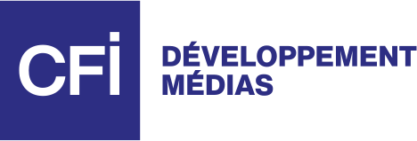 | Fair use | [www.africtivistes.com](https://www.africtivistes.com/wp-uploads/2026/06/logo.svg) (site asset, auto-detected img-logo) |
| Afrobarometer |  | Fair use | [www.afrobarometer.org](https://www.afrobarometer.org/wp-content/uploads/2025/02/cropped-AB-Social-Media-Icon-180x180.webp) (site asset, auto-detected apple-touch-icon) |
| AMAN – Coalition for Accountability and Integrity | 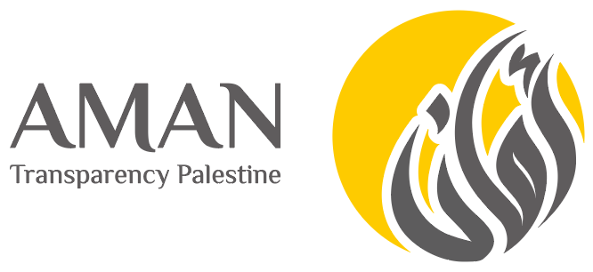 | Fair use | [www.aman-palestine.org](https://www.aman-palestine.org/assets/images/aman-logo1.png) (site asset, auto-detected og-image) |
| Anti-Corruption Foundation (FBK) |  | Fair use | [fbk.info](https://fbk.info/fbk_sharing_en.webp) (site asset, auto-detected og-image) |
| Association for Democratic Reforms (ADR) |  | Fair use | [adrindia.org](https://adrindia.org/sites/default/files/logo-adr-resized_0.png) (site asset, auto-detected img-logo) |
| Australian Democracy Network | 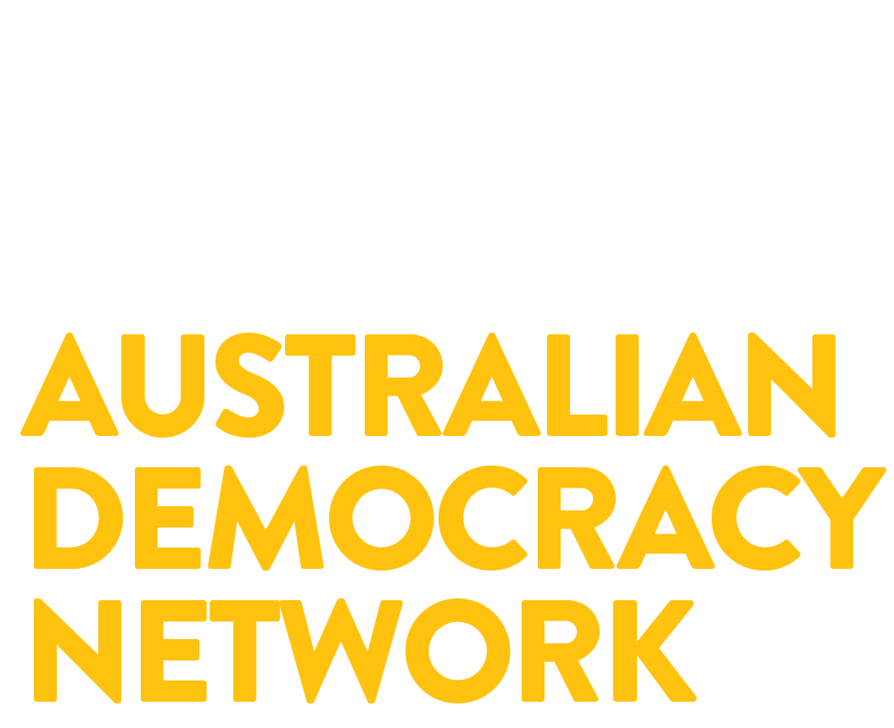 | Fair use | [raisely-images.imgix.net](https://raisely-images.imgix.net/australian-democracy-network/uploads/adn-logo-png-c92918.png) (site asset, auto-detected og-image) |
| Australian Democrats |  | Public domain | [Commons](https://commons.wikimedia.org/wiki/File:Australian_Democrats_2020_Logo.png) |
| Bersih |  | Fair use | [en.wikipedia.org](https://en.wikipedia.org/wiki/File:Bersih_Coalition_Logo.png) |
| Build a Ballot |  | Fair use | [cdn.prod.website-files.com](https://cdn.prod.website-files.com/6696ba979099335de734f100/677ca39faab6fa78a0fd88ff_Webclip.png) (site asset, auto-detected apple-touch-icon) |
| Canberra Alliance for Participatory Democracy (CAPaD) | 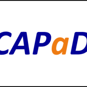 | Fair use | [canberra-alliance.org.au](https://canberra-alliance.org.au/wp-content/uploads/2023/12/cropped-CAPaD-Badge2-180x180.png) (site favicon, auto-detected apple-touch-icon) |
| Centre for Deliberative Democracy and Global Governance (CDDGG) |  | Fair use | [www.canberra.edu.au](https://www.canberra.edu.au/_designs/ucweb/common/images/logo/uc_logo_inline.png) (site asset, auto-detected img-logo) |
| Centre for Democracy and Development (CDD West Africa) |  | Fair use | [images.cddwestafrica.org](https://images.cddwestafrica.org/logo-inverted.png) (site asset, auto-detected img-logo) |
| Centro Gumilla |  | Fair use | [gumilla.org](https://gumilla.org/wp-content/uploads/2019/05/Recurso-1@2x-180x180.png) (site asset, auto-detected apple-touch-icon) |
| China Democratic League |  | Fair use | [www.mmzy.org.cn](https://www.mmzy.org.cn/gaiban/images/banner.png) (site banner with org name) |
| Chinese People's Political Consultative Conference (CPPCC) |  | Fair use | [subsites.chinadaily.com.cn](https://subsites.chinadaily.com.cn/cppcc/att/3865.files/i/logo.png) |
| CIDECI-Unitierra |  | Fair use | [unitierra.org](https://unitierra.org/favicon.png?2023-1-5-0-638518956496982390) (site asset, auto-detected favicon) |
| Citizen Assemblies for South Australia (CAfSA) |  | Fair use | [cafsa.org.au](https://cafsa.org.au/wp-content/uploads/2024/06/cafsa_logo_w.png) |
| Citizen OS |  | Fair use | [citizenos.com](https://citizenos.com/wp-content/uploads/2023/04/favicon.png) (site asset, auto-detected apple-touch-icon) |
| Citizens Foundation |  | Fair use | [citizens.is](https://citizens.is/assets/apple-touch-icon.png) (site asset, auto-detected apple-touch-icon) |
| Ciudadanía Inteligente |  | Fair use | [www.ciudadaniai.org](https://www.ciudadaniai.org/img/favicon.svg) (site asset, auto-detected svg-icon) |
| Civic Hive |  | Fair use | [civichive.org](https://civichive.org/storage/2022/02/cropped-Favicon-180x180.png) (site asset, auto-detected apple-touch-icon) |
| Civic Tech Field Guide |  | Fair use | [civictech.guide](https://civictech.guide) (auto-detected) |
| Civic Tech Innovation Network (CTIN) |  | Fair use | [civictech.africa](https://civictech.africa/wp-content/uploads/2021/12/CTIN-Landscape-Logo-20211210-123955-164x67.png) (site asset, auto-detected img-logo) |
| Civil Network OPORA |  | Fair use | [www.oporaua.org](https://www.oporaua.org/images/content_new.png) (site asset, auto-detected og-image) |
| Co-operative Bonds |  | Fair use | [bonds.coop](https://bonds.coop/wp-content/uploads/2024/10/blue-tree-100.png) (site asset, auto-detected apple-touch-icon) |
| Coalition of Everyone |  | Fair use | [web.archive.org](https://web.archive.org/web/*/https://coalitionofeveryone.com/) (auto-detected) |
| Code for Australia |  | Fair use | [www.codeforaustralia.org](https://www.codeforaustralia.org/icons/icon-512x512.png?v=765f7f7476587ee6cc4587183a27148b) (site asset, auto-detected apple-touch-icon) |
| Code for Japan |  | Fair use | [www.code4japan.org](https://www.code4japan.org/_next/static/media/codeforjapan_logo.6ccc2171.svg) (site asset, auto-detected img-logo) |
| Community Independents Project |  | Fair use | [static1.squarespace.com](http://static1.squarespace.com/static/61ef7749d7fb983988fcedbb/t/68842b7b2cec1240bb9ca31d/1677697362807/Humanitix+banner+%283%29.png?format=1500w) (site asset, auto-detected og-image) |
| CONAIE (Confederation of Indigenous Nationalities of Ecuador) |  | Fair use | [conaie.org](https://conaie.org) (auto-detected) |
| Congreso Visible |  | Fair use | [congresovisible.uniandes.edu.co](https://congresovisible.uniandes.edu.co/img/congreso-logo-footer.svg) (site asset, auto-detected img-logo) |
| Constitutional Clarion |  | Fair use | [yt3.googleusercontent.com](https://yt3.googleusercontent.com/GL8xUsc4KrdgARPW6yZUlXhuao9TtcpFfJ3mVnmogzLAxty4UxqwfPRI7kjshDeShzyOD1FGAA=s900-c-k-c0x00ffffff-no-rj) (site asset, auto-detected og-image) |
| Consul Democracy |  | Fair use | [consuldemocracy.org](https://consuldemocracy.org/wp-content/uploads/consul_logo.png) (site asset) |
| Conversations at the Crossroads |  | Fair use | [static1.squarespace.com](http://static1.squarespace.com/static/64d36751791400528caeedce/t/64d36c9fc4c6655ab4df2c85/1691577503576/outlinedlogo.png) (site asset, auto-detected og-image) |
| Darkenu |  | Fair use | [Commons](https://commons.wikimedia.org/wiki/File:%D7%9C%D7%95%D7%92%D7%95_%D7%AA%D7%A0%D7%95%D7%A2%D7%AA_%D7%93%D7%A8%D7%9B%D7%A0%D7%95.png) |
| Decidim |  | CC BY-SA 4.0 | [Commons](https://commons.wikimedia.org/wiki/File:Decidim-logo.svg) |
| Delibera Brasil | 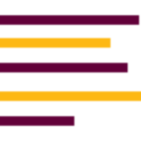 | Fair use | [deliberabrasil.org](https://deliberabrasil.org/wp-content/uploads/2020/05/cropped-menu-180x180.png) (site asset, auto-detected apple-touch-icon) |
| Democracy Club |  | Fair use | [democracyclub.org.uk](https://democracyclub.org.uk/static/images/logo_icon.f6d00edbdf1e.svg) (site asset, auto-detected img-logo) |
| DEMOCRACY Deutschland |  | Fair use | [democracy-app.de](https://democracy-app.de/apple-touch-icon.png) (site asset, auto-detected apple-touch-icon) |
| Democracy Earth Foundation |  | Fair use | [democracy.earth](https://democracy.earth/assets/democracy-earth-logo-DadoaX03.png) (logo icon, from democracy.earth assets) |
| Democracy in Colour |  | Fair use | [democracyincolour.org](https://democracyincolour.org/wp-content/uploads/2025/09/cropped-Logo-C-180x180.png) (site favicon, auto-detected apple-touch-icon) |
| Democracy International |  | Fair use | [www.democracy-international.org](https://www.democracy-international.org/themes/custom/di/favicon.ico) (site favicon, auto-detected) |
| Democracy Technologies |  | Fair use | [democracy-technologies.org](https://democracy-technologies.org/wp-content/uploads/2024/07/cropped-favicon-180x180.png) (site asset, auto-detected apple-touch-icon) |
| DemocracyCo |  | Fair use | [www.democracyco.com.au](https://www.democracyco.com.au/wp-content/uploads/2023/07/Main-Logo.svg) (site asset, auto-detected img-logo) |
| DemocracyLab |  | Fair use | [esal.us](https://esal.us/wp-content/uploads/2019/01/DemocracyLab-Logo-768x302.png) (logo wordmark, hosted on esal.us) |
| DemocracyNext |  | Fair use | [www.demnext.org](https://www.demnext.org/assets/images/favicons/apple-touch-icon.png) (site asset, auto-detected apple-touch-icon) |
| Designing Open Democracy |  | Fair use | [www.designingopendemocracy.com](https://www.designingopendemocracy.com) (auto-detected) |
| DiEM25 | 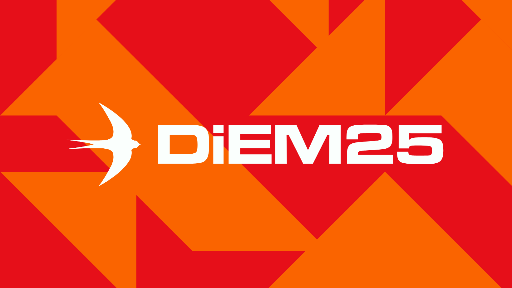 | Fair use | [lookaside.fbsbx.com](https://lookaside.fbsbx.com/lookaside/crawler/media/?media_id=711416467840396) |
| Digidem Lab |  | Fair use | [digidemlab.org](https://digidemlab.org/wp-content/uploads/2025/05/digidemlab-logo-XL.png) (site asset, auto-detected img-logo) |
| Démocratie Ouverte |  | Fair use | [cdn.prod.website-files.com](https://cdn.prod.website-files.com/631702cc8aece668e2622c8a/64272fa830147f736cbfb3a0_DO-logo-couleur-DO%20(2).jpg) (site asset, auto-detected apple-touch-icon) |
| Earthworker Cooperative |  | Fair use | [earthworker.coop](https://earthworker.coop/wp-content/uploads/Earthworker_logo_rectangle_long-rvs-1.png) (site asset, auto-detected img-logo) |
| Electoral Institute for Sustainable Democracy in Africa (EISA) |  | Fair use | [www.eisa.org](https://www.eisa.org/storage/2024/03/electoral-institute-for-sustainable-democracy-in-africa-logo-eisa-english.jpg) (site asset, auto-detected img-logo) |
| Electoral Reform Society |  | Fair use | [electoral-reform.org.uk](https://electoral-reform.org.uk/wp-content/uploads/2017/06/cropped-favicon-200x200.png) (site asset, auto-detected apple-touch-icon) |
| Espacio Público |  | Fair use | [www.espaciopublico.cl](https://www.espaciopublico.cl/wp-content/uploads/2021/04/LOGO-EP_color.png) (site asset, auto-detected img-logo) |
| Ethelo |  | Fair use | [ethelo.com](https://ethelo.com/wp-content/uploads/2025/01/cropped-ethelo-button-logo-decisions-blue-1-Photoroom-1-180x180.png) (site asset, auto-detected apple-touch-icon) |
| Ette Media |  | Fair use | [storage.ghost.io](https://storage.ghost.io/c/3a/b9/3ab98359-2edd-44f0-abae-34759c5d6d5b/content/images/2026/03/logo-motto3.png) (site asset, auto-detected img-logo) |
| FIDE — Federation for Innovation in Democracy | 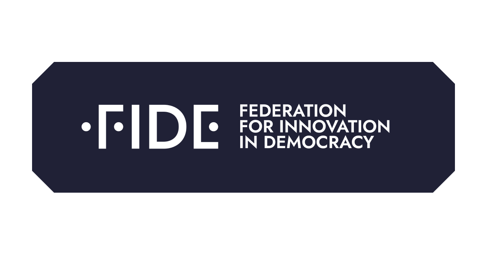 | Fair use | [static1.squarespace.com](http://static1.squarespace.com/static/6881f170e22de75639597035/t/692d8822704a776c868f1604/1764591650146/Social+Icon.png?format=1500w) (site asset, auto-detected og-image) |
| Flux Party |  | Fair use | [www.designingopendemocracy.com](https://www.designingopendemocracy.com/organisations/flux-party/) (site asset) |
| Foro Nacional por Colombia |  | Fair use | [foro.org.co](https://foro.org.co/wp-content/uploads/2025/10/logo_fnc.svg) (site asset, navbar logo) |
| Fundación Solón |  | Fair use | [fundacionsolon.org](https://fundacionsolon.org/wp-content/uploads/2026/07/cropped-fundacion-solon-azul.png) (site asset, auto-detected img-logo) |
| Fundacja Stocznia | 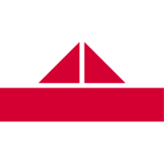 | Fair use | [stocznia.org.pl](https://stocznia.org.pl/fav/apple-touch-icon.png) (site asset, auto-detected apple-touch-icon) |
| G!LT (Offene Demokratie) |  | Fair use | [www.gilt.at](https://www.gilt.at/wp-content/uploads/2024/09/logo-gilt.png) (site asset, auto-detected img-logo) |
| g0v (gov zero) |  | Fair use | [g0v.tw](https://g0v.tw/assets/img/g0v-only.svg) (site asset) |
| G1000 |  | Fair use | [www.g1000.org](https://www.g1000.org/themes/custom/touchicons/apple-touch-icon-152x152.png) (site asset, auto-detected apple-touch-icon) |
| Golos |  | Fair use | [web.archive.org](https://web.archive.org/web/*/https://www.golos.org/) (auto-detected) |
| Gorée Institute | 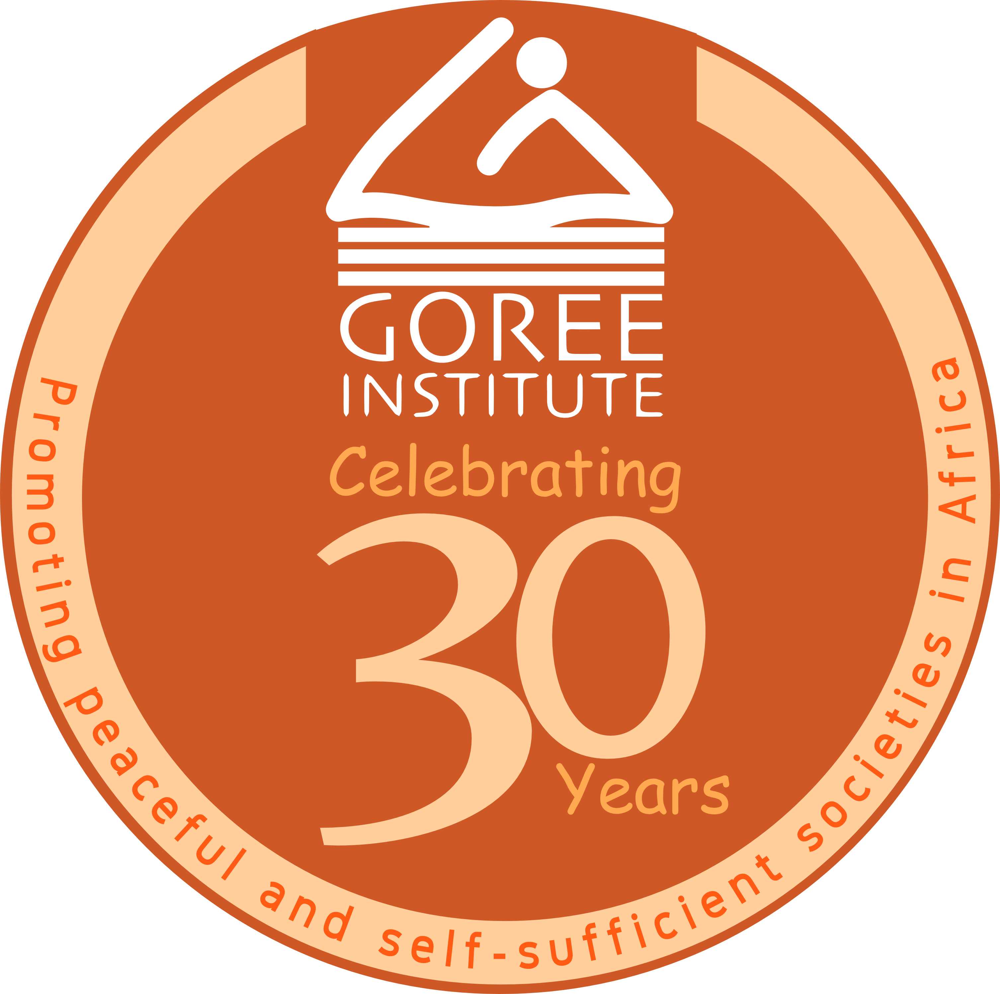 | Fair use | [goreeinstitut.org](https://goreeinstitut.org/wp-content/uploads/2024/12/Gorin30ans.png) (site asset, auto-detected img-logo) |
| Governance Hub Africa | 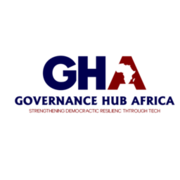 | Fair use | [governancehubafrica.org](https://governancehubafrica.org/apple-touch-icon.png?v=2) (site asset, auto-detected apple-touch-icon) |
| Grattan Institute |  | Fair use | [grattan.edu.au](https://grattan.edu.au/wp-content/uploads/2021/07/cropped-grattanfavicon-180x180.png) (site asset, auto-detected apple-touch-icon) |
| Healthy Democracy |  | Fair use | [healthydemocracy.org](https://healthydemocracy.org/wp-content/uploads/logo-200.svg) (site asset, auto-detected img-logo) |
| Helen Clark Foundation |  | Fair use | [helenclark.foundation](https://helenclark.foundation/favicons/apple-touch-icon.png) (site asset, auto-detected apple-touch-icon) |
| Hong Kong Democracy Council (HKDC) |  | Fair use | [static.wixstatic.com](https://static.wixstatic.com/media/b76ce4_9ffa8165eb174ed09c1415dd0111075c~mv2.png/v1/fill/w_138,h_81,al_c,q_85,usm_0.66_1.00_0.01,enc_avif,quality_auto/Logowithname_white.png) (site asset, auto-detected img-logo) |
| Horizon State |  | Fair use | [web.archive.org](https://web.archive.org/web/*/https://horizonstate.com/) (auto-detected) |
| Institute for China's Democratic Transition (ICDT) |  | Fair use | [chinademocrats.org](https://chinademocrats.org/favicon.ico) (site favicon, auto-detected) |
| Instituto Update |  | Fair use | [www.institutoupdate.org.br](https://www.institutoupdate.org.br/wp-content/uploads/2024/10/logo-iu-blanco.svg) (site asset, auto-detected img-logo) |
| International IDEA |  | Fair use | [www.idea.int](https://www.idea.int/themes/custom/tema/favicon.ico) (site favicon, auto-detected) |
| Internet Freedom Foundation | 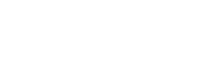 | Fair use | [internetfreedom.in](https://internetfreedom.in/images/logo.svg) |
| Israel Democracy Institute (IDI) |  | Fair use | [en.idi.org.il](https://en.idi.org.il/images/logo-print.png) (site asset, auto-detected img-logo) |
| ITS Rio | 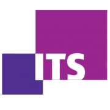 | Fair use | [itsrio.org](https://itsrio.org/wp-content/uploads/2017/02/cropped-itsrio_favicon-180x180.png) (site favicon, auto-detected apple-touch-icon) |
| Janaagraha Centre for Citizenship and Democracy |  | Fair use | [www.janaagraha.org](https://www.janaagraha.org/wp-content/uploads/2022/11/1.svg) |
| Join (join.gov.tw) |  | Fair use | [join.gov.tw](https://join.gov.tw/images/favicon.ico) (site favicon (multi-res .ico, 48x48 extracted), manually selected over a low-confidence og:image guess) |
| Kialo | 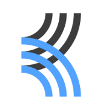 | Fair use | [www.kialo.com](https://www.kialo.com/assets/hashed/kialo_logo_square_180x180.b17987150c2b1163.webp) |
| Kongra Star (Women's Congress) |  | Fair use | [kongra-star.org](https://kongra-star.org/ar/wp-content/uploads/2020/05/Kongra-Star01.png) (site asset, auto-detected img-logo) |
| Labsus — Laboratorio per la Sussidiarietà |  | Fair use | [www.labsus.org](https://www.labsus.org/wp-content/uploads/2023/03/cropped-favicon-new-1-180x180.png) (site asset, auto-detected apple-touch-icon) |
| Lamestream |  | Fair use | [storage.ghost.io](https://storage.ghost.io/c/63/10/6310462c-2ac5-4438-80a0-fa232721b437/content/images/2025/09/logo-new-1.png) (site asset, auto-detected img-logo) |
| Lateral Economics |  | Fair use | [static1.squarespace.com](http://static1.squarespace.com/static/69aedc3382b849546e21f454/t/69b99f95a71d606b08bd6d85/1773772693589/lateral_economicsVector+.jpg) (site asset, auto-detected og-image) |
| Lebanese Center for Policy Studies (LCPS) |  | Fair use | [www.instagram.com](https://www.instagram.com/lcpslebanon/) (Instagram profile picture, square crop of organizational logo) |
| Liquid Democracy e.V. |  | Fair use | [github.com](https://github.com/liqd) (GitHub organisation avatar (logo mark)) |
| LiquidFeedback |  | Fair use | [liquidfeedback.com](https://liquidfeedback.com/images/favicon.png) (site asset, auto-detected favicon) |
| Lismore People's Assembly | 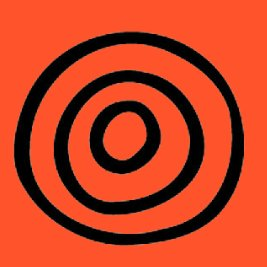 | Fair use | [www.instagram.com](https://www.instagram.com/lismorepeoplesassembly/) (logo (icon); banner from https://reclaim.org.au/wp-content/uploads/2025/05/LPA-Blog-Feature-01.jpg) |
| Loomio |  | Fair use | [www.loomio.com](https://www.loomio.com/images/brand/icon-yellow-on-white-1024.png) (brand asset) |
| Luminate |  | Fair use | [www.luminategroup.com](https://www.luminategroup.com/images/fav/apple-touch-icon.png) (site asset, auto-detected apple-touch-icon) |
| Make It 16 |  | Fair use | [static.wixstatic.com](https://static.wixstatic.com/media/a1217e_53137cfa844d42cc9a2064cb6f731470~mv2.png/v1/fill/w_113,h_52,al_c,q_95,usm_0.66_1.00_0.01,enc_avif,quality_auto/LogoOrange%20(2).png) (site asset, auto-detected img-logo) |
| MASS LBP |  | Fair use | [static1.squarespace.com](http://static1.squarespace.com/static/6005ceb747a6a51d636af58d/t/65a2dab9ac1b343be07208bc/1705171641767/mass2blue.png?format=1500w) (site asset, auto-detected og-image) |
| McGuinness Institute | 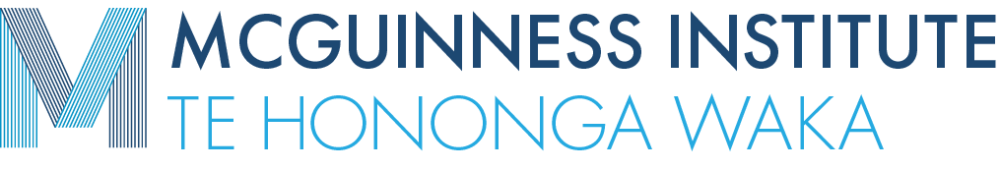 | Fair use | [www.mcguinnessinstitute.org](https://www.mcguinnessinstitute.org/wp-content/uploads/2020/01/20180319-MI-logo3.png) (site asset, auto-detected img-logo) |
| McKinnon (formerly Susan McKinnon Foundation) |  | Fair use | [mckinnon.co](https://mckinnon.co/favicon/apple-touch-icon.png) (site favicon, auto-detected apple-touch-icon) |
| MEMO 98 |  | Fair use | [memo98.sk](https://memo98.sk/favicon.svg) (site asset, auto-detected svg-icon) |
| Memorial |  | Fair use | [www.memorial.de](https://www.memorial.de/files/layout/logo.png) (site asset, auto-detected img-logo) |
| MieuxVoter |  | Fair use | [mieuxvoter.fr](https://mieuxvoter.fr/favicon.ico) (site favicon, auto-detected) |
| MiVote |  | Fair use | [web.archive.org](https://web.archive.org/web/*/https://www.mivote.org.au/) (MiVote branding, extracted from Values & Vision PDF) |
| MosaicLab |  | Fair use | [images.squarespace-cdn.com](https://images.squarespace-cdn.com/content/v1/57688da046c3c4f6756fd256/4f0e775b-4146-4bee-b18f-a7a26a4b133b/MosaicLab-logo-2017-blue-nooutline.png?format=1500w) (logo wordmark, from MosaicLab's Squarespace CDN) |
| Movement for Quality Government in Israel (MQG) |  | Fair use | [mqg.org.il](https://mqg.org.il/wp-content/uploads/2024/02/icon.png) (site asset, auto-detected apple-touch-icon) |
| Movilizatorio |  | Fair use | [www.movilizatorio.org](https://www.movilizatorio.org/wp-content/uploads/2025/09/cropped-Foto-de-Perfil-REDES_Favicon-180x180.png) (site asset, auto-detected apple-touch-icon) |
| mySociety |  | Fair use | [www.mysociety.org](https://www.mysociety.org/wp-content/themes/mysociety-new/assets/img/mysociety-logo-white@2.png) (logo wordmark, from mysociety.org theme assets) |
| NAMFREL |  | Fair use | [journal.com.ph](https://journal.com.ph/wp-content/uploads/2023/02/NAMFREL-1200x800.jpg) |
| newDemocracy Foundation |  | Fair use | [www.newdemocracy.com.au](https://www.newdemocracy.com.au/wp-content/uploads/2021/09/ND_logo_Twitter.jpg) (site asset, auto-detected img-logo) |
| NewVote |  | Fair use | [images.squarespace-cdn.com](https://images.squarespace-cdn.com/content/v1/59422e279f74562727baa701/1560256481464-INQ0ZHYSBBYA8W18DPNG/Final_Files_RGB-02.png) (site asset, auto-detected img-logo) |
| None of the Above Party (Canada) |  | Fair use | [nota.ca](https://nota.ca/wp-content/uploads/2018/05/ico.png) (site asset, auto-detected apple-touch-icon) |
| NZ Council for Civil Liberties |  | Fair use | [nzccl.org.nz](https://nzccl.org.nz/wp-content/uploads/favicon.ico) (site asset, auto-detected apple-touch-icon) |
| Open Knowledge Brasil (OKBR) | 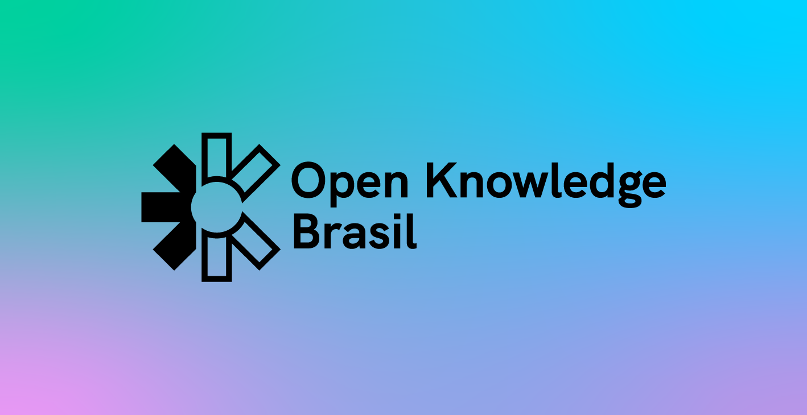 | Fair use | [ok.org.br](https://ok.org.br/wp-content/uploads/2023/11/011123-site-logo-150.png) (site asset, auto-detected og-image) |
| Open Society Foundations |  | Fair use | [www.opensocietyfoundations.org](https://www.opensocietyfoundations.org/dist/images/favicons/favicon-120.png) (site asset, auto-detected apple-touch-icon) |
| OpenAustralia Foundation |  | Fair use | [i0.wp.com](https://i0.wp.com/oaf.org.au/wp-content/uploads/2025/10/cropped-LinkedIn-Logo-2024.png?fit=180%2C180&#038;ssl=1) (site asset, auto-detected apple-touch-icon) |
| Participatory Budgeting Project |  | Fair use | [www.participatorybudgeting.org](https://www.participatorybudgeting.org/wp-content/uploads/2023/10/PBP-Stacked-Color.png) (stacked color logo, from site schema (JSON-LD)) |
| Participedia |  | Fair use | [participedia.net](https://participedia.net/images/participedia-social-img.jpg) (site asset, auto-detected og-image) |
| People Decide |  | Fair use | [web.archive.org](https://web.archive.org/web/*/https://www.peopledecide.org.au) (auto-detected) |
| People Powered | 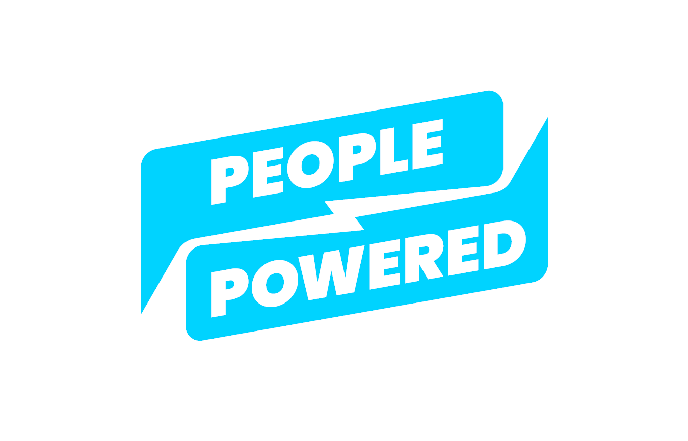 | Fair use | [static1.squarespace.com](http://static1.squarespace.com/static/5e96d0e66ae22d58e7c3219f/t/5f16f8999b27dd7e0759bc90/1646413130824/PeoplePowered_RGB_SkyBlue+white.png?format=1500w) (site asset, auto-detected og-image) |
| People's Solidarity for Participatory Democracy (PSPD) |  | Fair use | [pspd-www.s3.ap-northeast-2.amazonaws.com](https://pspd-www.s3.ap-northeast-2.amazonaws.com/wp-content/uploads/2022/09/27143641/pspd_favicon.svg) (site asset, auto-detected apple-touch-icon) |
| Perludem |  | Fair use | [perludem.or.id](https://perludem.or.id/wp-content/uploads/2016/10/cropped-Logo-Perludem-300-x-84.jpg.jpg) (site asset, auto-detected img-logo) |
| Pirate Party Australia |  | CC BY-SA 3.0 | [Commons](https://commons.wikimedia.org/wiki/File:Pirate_Party_Australia_logo.svg) |
| Pol.is |  | Fair use | [pol.is](https://pol.is/favicon.ico) (site favicon, auto-detected) |
| Prediki |  | Fair use | [www.prediki.com](https://www.prediki.com/static/img/prediki_logo.svg) (site asset, auto-detected favicon) |
| Proportional Representation Society of Australia |  | Fair use | [www.prsa.org.au](https://www.prsa.org.au/logo.jpg) (site asset, auto-detected img-logo) |
| PRS Legislative Research |  | Fair use | [prsindia.org](https://prsindia.org/favicon.ico) (site favicon, auto-detected) |
| RadicalxChange Foundation |  | Fair use | [www.radicalxchange.org](https://www.radicalxchange.org/images/logos/favicon.png) (site icon) |
| Rwanda Governance Board (RGB) |  | Fair use | [www.rgb.rw](https://www.rgb.rw/_assets/848a49247fad16e632dbfe56b131f2ac/Images/Coat.png) (official coat of arms, site favicon) |
| SecureVote |  | Fair use | [web.archive.org](https://web.archive.org/web/*/https://secure.vote) (auto-detected) |
| Sitra | 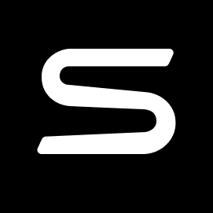 | Fair use | [www.sitra.fi](https://www.sitra.fi/wp-content/themes/sitra-25/build/img/favicon/favicon.svg) (site asset, auto-detected svg-icon) |
| SoCentral | 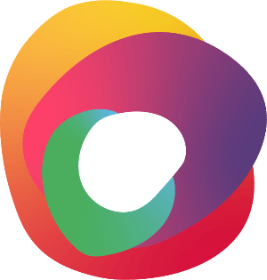 | Fair use | [cdn.prod.website-files.com](https://cdn.prod.website-files.com/633d71ff5625100570e7e68c/66e19172d430486db950a004_SoCentral_logo.png) (site asset, auto-detected img-logo) |
| Sortition Foundation |  | Fair use | [assets.nationbuilder.com](https://assets.nationbuilder.com/sortitionfoundation/pages/396/meta_images/original/Share_Image_-_Sortition_Foundation.png?1598456341) (site asset, auto-detected og-image) |
| Sortition Foundation (Australia) |  | Fair use | [assets.nationbuilder.com](https://assets.nationbuilder.com/sortitionfoundation/sites/7/meta_images/original/Logo_Sortition_Foundation_Landscape.png?1620659686) (site asset, auto-detected og-image) |
| Team Mirai | 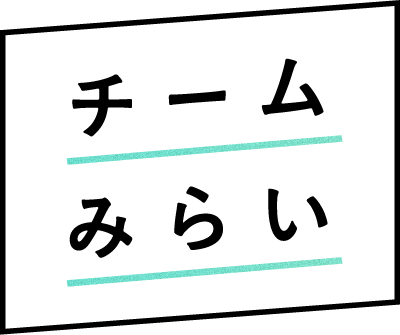 | Fair use | [team-mir.ai](https://team-mir.ai/logo_flat.png) (site asset, auto-detected img-logo) |
| TEV-DEM |  | Fair use | [lookaside.fbsbx.com](https://lookaside.fbsbx.com/lookaside/crawler/media/?media_id=100069430440176) |
| The Australia Institute — Democracy & Accountability Program |  | Fair use | [australiainstitute.org.au](https://australiainstitute.org.au/wp-content/themes/tai-theme/apple-touch-icon-precomposed.png) (site asset, auto-detected apple-touch-icon) |
| The Democracy Foundation |  | Fair use | [web.archive.org](https://web.archive.org/web/*/https://democracy.foundation/) (auto-detected) |
| They Vote For You |  | Fair use | [theyvoteforyou.org.au](https://theyvoteforyou.org.au) (auto-detected) |
| Transparencia por Colombia | 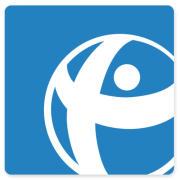 | Fair use | [transparenciacolombia.org.co](https://transparenciacolombia.org.co/wp-content/uploads/cropped-indice-integridad-nacional-2002-portadas-02-01-180x180.png) (site asset, auto-detected apple-touch-icon) |
| Transparency International New Zealand (TINZ) |  | Fair use | [cdn.prod.website-files.com](https://cdn.prod.website-files.com/5f3c5d2bb263505e25811876/5f6b01380a9405467bf03b1a_TINZ-Logo-web-blue%201.svg) (site asset, auto-detected img-logo) |
| Ushahidi |  | Fair use | [www.ushahidi.com](https://www.ushahidi.com/favicon.ico) (site favicon, auto-detected) |
| Vietnam Fatherland Front (VFF) |  | Fair use | [mattran.org.vn](https://mattran.org.vn/mt-favicon.ico) (official emblem, site favicon) |
| Vote Monitor |  | Fair use | [web.archive.org](https://web.archive.org/web/*/https://votemonitor.org/) (auto-detected) |
| vTaiwan |  | Fair use | [vtaiwan.tw](https://vtaiwan.tw/apple-touch-icon.png) (site icon) |
| We Do Democracy | 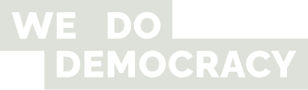 | Fair use | [www.wedodemocracy.dk](https://www.wedodemocracy.dk/wp-content/uploads/2022/06/Logo.png) (site asset, auto-detected img-logo) |
| WeCollect | 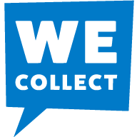 | Fair use | [www.wecollect.ch](https://www.wecollect.ch/android/android-icon-192x192.png) (site asset, auto-detected apple-touch-icon) |
| Your Party |  | Public domain | [Commons](https://commons.wikimedia.org/wiki/File:Your_Party_logo.svg) |
| À Nous La Démocratie! |  | Fair use | [anouslademocratie.fr](https://anouslademocratie.fr/wp-content/uploads/2017/09/cropped-a-nous-la-democratie.png) (site asset, auto-detected img-logo) |

## Adding a logo

Run `python util/check_logo.py --slug <org-slug> --write` to probe the org's own website and
download the best logo candidate automatically. It writes the image to
`docs/assets/org-logos/<slug>.<ext>`, sets `logo:` in the org's frontmatter, and updates this
README's table. Only high-confidence candidates (an explicit `` logo tag, an SVG favicon,
or an apple-touch-icon) are written by default — pass `--include-low` to also accept a
lower-confidence guess (a generic favicon or social-share image), and spot-check those visually
afterwards.

To add one by hand instead:

1. Download the highest-quality version available (prefer SVG, then PNG) from the org's own
   site, or from Wikimedia Commons if a suitably licensed version exists there.
2. Place it at `docs/assets/org-logos/<org-slug>.<ext>`, where `<org-slug>` matches the org's
   filename under `docs/organisations/` (without `.md`).
3. Add `logo: /assets/org-logos/<org-slug>.<ext>` to the org's frontmatter.
   - A remote URL (e.g. a Wikimedia Commons or the org's own hosted file) is also valid when a
     local copy isn't warranted — see the international-comparator pattern in
     `docs/assets/party-logos/README.md`.
4. For non-free/fair use logos, prefer the org's own official site asset (favicon, brand kit,
   masthead) over a third-party mirror.
5. Add an entry to `docs/assets/org-logos/sources.json` (slug → title/path/license/source/note)
   and re-run the script (or just edit the table above) so it stays in sync.
