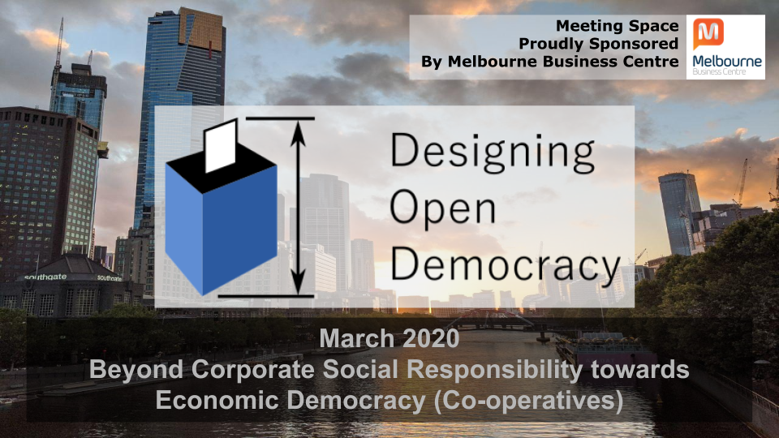
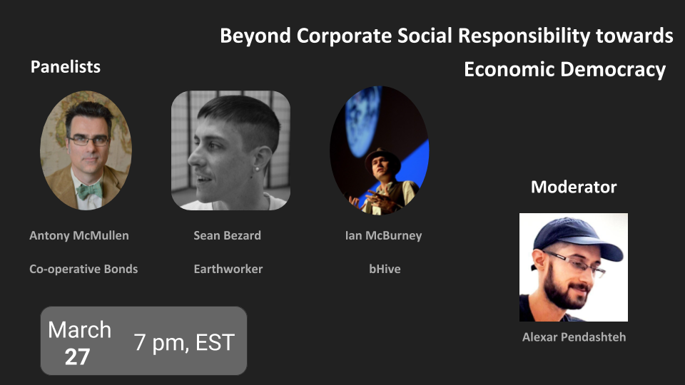
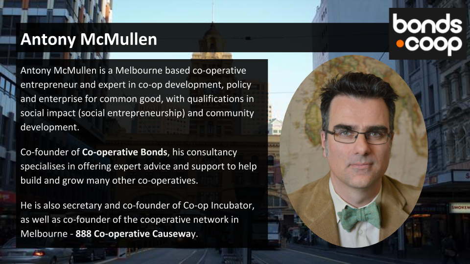
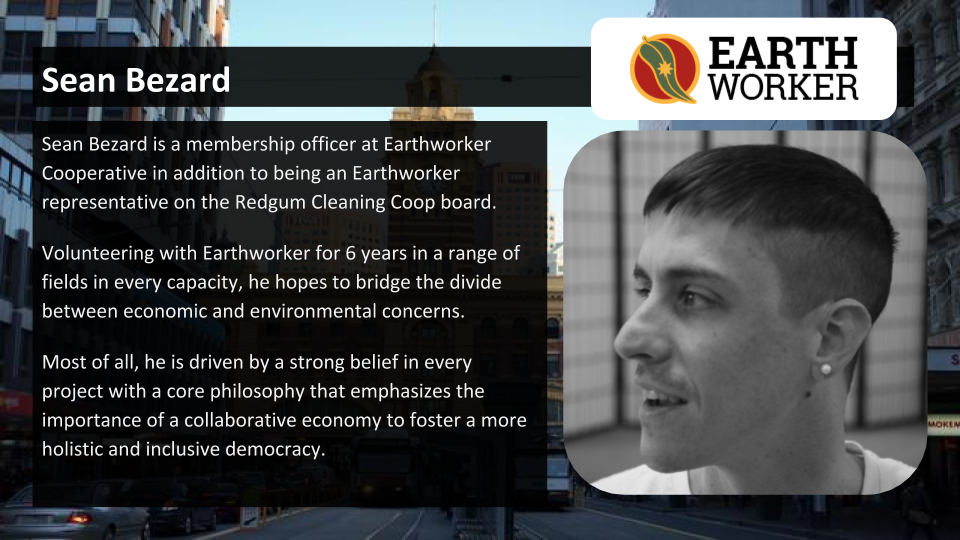
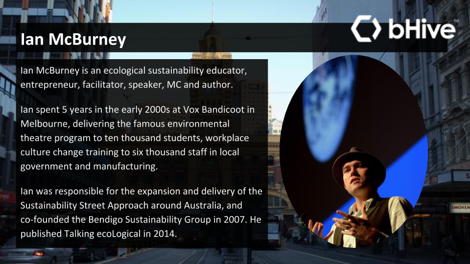

# Podcast: Beyond Corporate Social Responsibility towards Economic Democracy

**You can find our podcast in all your podcast apps as "Designing Open Democracy" such as Apple podcast or Spotify**

 

 

Hi and welcome to the Designing Open Democracy Podcast. We are an Australian based forum keeping track of democracy innovations in Australia and around the world. In the background of the banking royal commission starting at 2017 and the uncovering of banking misconduct by the big four banks in Australia, there is a need for the public to be able to trust that corporations will work in the interest of all stakeholders.

This podcast recorded and hosted by Alexar on March 2020, was a talk by Anthony McMullen from Co-operative Bonds, explaining how we can step beyond Corporate Social Responsibility towards a corporate structure with a fundamentally more democratic economic structure. Given the situation around the world with the global pandemic in 2020, social distancing requirements meant we had to record this episode by video conferencing. So audio quality will be different compared to other episodes.

The first half of this event with be a short primer by Anthony McMullen to get newcomers up to speed about what Co-operatives is and why it matters. Afterwards a panel led by Anthony McMullen will be held to discuss about the state of co-operatives in Australia and how co-operatives can gain traction against traditional forms of business structures.

<!-- more -->

# Speakers Biography

## Antony McMullen (Co-operative Bonds)

 

Antony McMullen is a Melbourne based co-operative entrepreneur and expert in co-op development, policy and enterprise for common good, with qualifications in social impact (social entrepreneurship) and community development.

Co-founder of Co-operative Bonds, his consultancy specialises in offering expert advice and support to help build and grow many other co-operatives.

He is also secretary and co-founder of Co-op Incubator, as well as co-founder of the cooperative network in Melbourne - 888 Co-operative Causeway.

In addition he also collaboratively prepared the Co-operative and Mutual Enterprise (CME) governance framework for the Australian Business Council of Co-operatives and Mutuals in 2018.

Serving as Vice-President of the Victoria Day Council (that administers the Victorian of the Year award), he also holds qualifications in social impact (social entrepreneurship) and community development.

https://www.bonds.coop/

## Sean Bezard (Earthworker Cooperative)

 

Sean Bezard is a membership officer at Earthworker Cooperative in addition to being an Earthworker representative on the Redgum Cleaning Coop board.

Volunteering with Earthworker for 6 years in a range of fields in every capacity, he hopes to bridge the divide between economic and environmental concerns.

Most of all, he is driven by a strong belief in every project with a core philosophy that emphasises the importance of a collaborative economy to foster a more holistic and inclusive democracy.

https://earthworkercooperative.com.au/

## Ian McBurney (bHive)

Ian McBurney is an ecological sustainability educator, entrepreneur, facilitator, speaker, MC and author.

His specialty is change practice: how do we inspire others around us?

Ian spent 5 years in the early 2000s at Vox Bandicoot (http://voxbandicoot.com.au/) in Melbourne, delivering the famous environmental theatre program to ten thousand students, workplace culture change training to six thousand staff in local government and manufacturing.

https://bhive.coop/about/