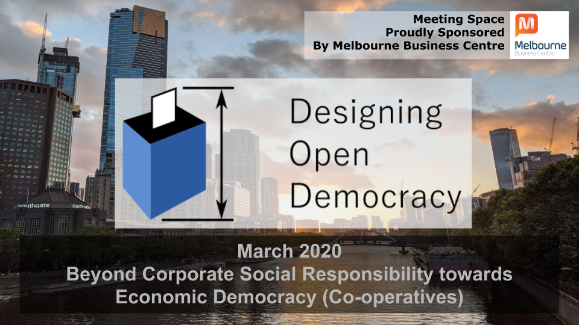
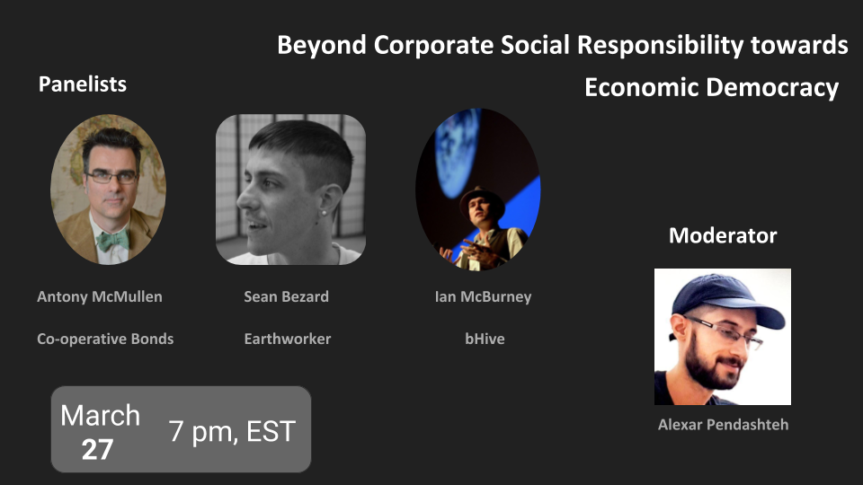
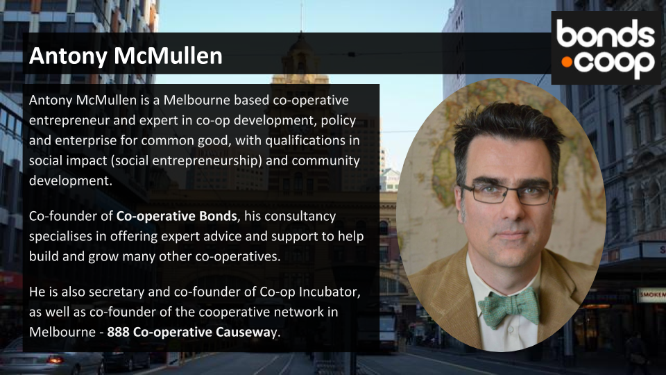
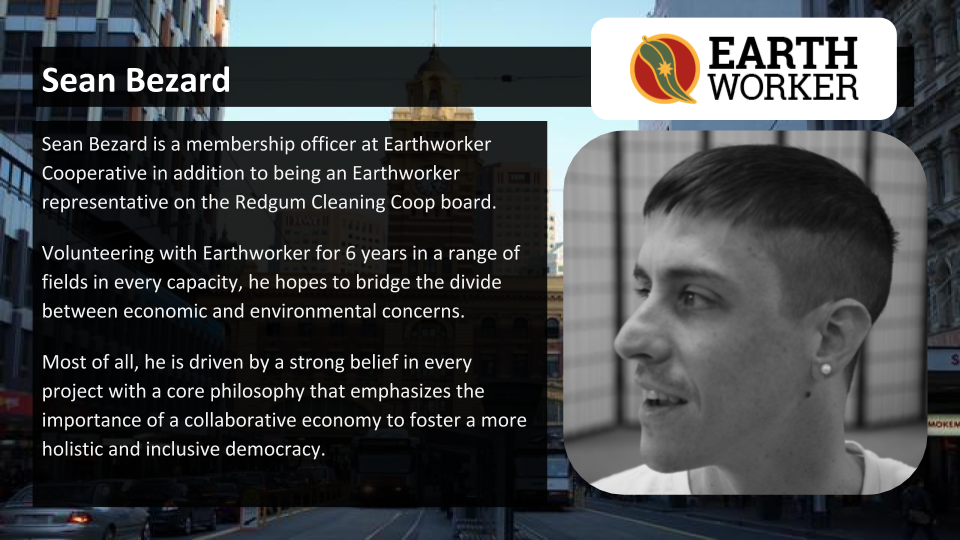
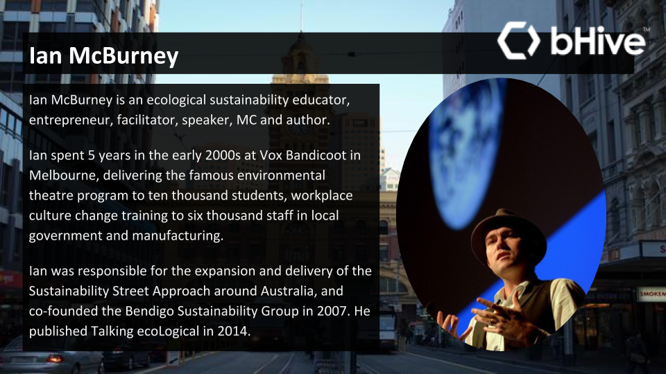

---
authors:
- Claude
ai_assisted: true
categories: [podcast]
date: 2020-06-20 00:00:00
summary: In this podcast episode, the Designing Open Democracy forum explores the
  concept of Economic Democracy and how it goes beyond Corporate Social Responsibility.
  They discuss democracy innovations in Australia and around the world related to
  economic democracy.
tags:
- podcast
- Corporate Social Responsibility
- Economic Democracy
- Designing Open Democracy
title: 'Podcast: Beyond Corporate Social Responsibility towards Economic Democracy'
---

# Podcast: Beyond Corporate Social Responsibility towards Economic Democracy

**You can find our podcast in all your podcast apps as "Designing Open Democracy" such as Apple podcast or Spotify**

 

 

Hi and welcome to the Designing Open Democracy Podcast. We are an Australian based forum keeping track of democracy innovations in Australia and around the world. In the background of the banking royal commission starting at 2017 and the uncovering of banking misconduct by the big four banks in Australia, there is a need for the public to be able to trust that corporations will work in the interest of all stakeholders.

This podcast recorded and hosted by Alexar on March 2020, was a talk by Anthony McMullen from Co-operative Bonds, explaining how we can step beyond Corporate Social Responsibility towards a corporate structure with a fundamentally more democratic economic structure.

The event was originally scheduled as an in-person meetup for 27 March 2020 at the Melbourne Business Centre (Level 9, 440 Collins St, Melbourne), with the venue itself as sponsor. As COVID-19 restrictions escalated through March 2020, [the in-person gathering was cancelled](https://www.meetup.com/designingopendemocracy/events/268671270/) and [replaced with an online event on the same date](https://www.meetup.com/designingopendemocracy/events/269521076/) — pitched as "an opportunity for everyone around Australia to gather around this month" — with the talk recorded by video conference instead. Given the situation around the world with the global pandemic in 2020, social distancing requirements meant we had to record this episode this way. So audio quality will be different compared to other episodes.

The first half of this event with be a short primer by Anthony McMullen to get newcomers up to speed about what Co-operatives is and why it matters. Afterwards a panel led by Anthony McMullen will be held to discuss about the state of co-operatives in Australia and how co-operatives can gain traction against traditional forms of business structures.

<!-- more -->

> *The summary and analysis below were drafted by Claude Code from the episode's
> automated transcript, to bring this older post up to the standard of the newer
> ones. The speaker biographies are preserved at the foot of the post. Quotes are
> reconstructed from an auto-generated transcript — verify against the recording
> before citing.*

## Co-ops 101: democracy as an economic structure, not just a political one

Antony McMullen opens with a definition that sets up the whole talk: a cooperative is "an autonomous association of persons... united voluntarily to meet their common economic, social and cultural needs and aspirations through a jointly-owned and democratically-controlled enterprise." Strip away the jargon and it's **a democratically owned and controlled business** — and that ownership structure, he argues, is where economic democracy actually lives, distinct from the political kind:

> "So often when we think of democracy, we just think of the government, think of elections. But the cultural piece is actually making democracy work for you and I through these enterprises that we build and operate together."

He frames every co-op member as wearing **four hats** (citing UWA academic Tim Mazzarol): patron (customer or worker), owner, investor, and community member. The cooperative model tries to align all four — where a conventional business structurally separates them and channels the returns to whichever hat (usually "investor") holds the power.

The seven Rochdale-derived [cooperative](../../concepts/cooperative.md) principles get a quick run-through — voluntary and open membership, democratic member control, members' economic participation, autonomy, education, cooperation among cooperatives, and concern for community — but the line that does the most work is about *purpose*:

> "Co-ops make money to do good stuff. They're not doing stuff to make money."

Cooperatives aren't quite not-for-profits either — they're **profit-minimising**: surplus exists to cover costs, manage risk and fund the future, not to be extracted by outside shareholders. McMullen's example is **Stocksy**, a photographer-owned stock-photography cooperative: instead of selling images to Getty or iStock and watching most of the margin go to investors, the photographers *are* the investors, owners and patrons — and the return on their work changes accordingly.

On scale, he points to the **Evergreen Cooperatives** in Cleveland (solar, urban-farming greenhouses, an industrial laundry — all employee-owned and explicitly built as local economic development) and to **Mondragon** in the Basque Country: roughly 70,000 employees, the seventh-largest corporate group in Spain, built up from nothing after the Spanish Civil War, starting with *education* before there was even a product.

Setting one up, in Australia, is mechanically simple: five people, an agreed set of rules, and registration with your state's cooperative registrar (Consumer Affairs Victoria, in McMullen's case) under the Cooperatives National Law framework. [Get Mutual](https://getmutual.coop/) provides a rules-builder; the [Business Council of Co-operatives and Mutuals](https://bccm.coop/) is the national peak body.

## Earthworker and Red Gum: cooperative governance, day to day

Sean Bezard, from [Earthworker Cooperative](../../organisations/earthworker-cooperative.md), grounds the abstractions in how one cooperative actually runs. **Red Gum Cleaning Co-op** (started February 2018, "got gangbusters", 50+ regular clients, Employee Ownership Australia SME Award 2018) has a board of five worker-member directors plus two non-member directors who bring outside expertise — Bezard, representing Earthworker, and a lawyer. Board positions (finance, secretary, union delegate) rotate among members so everyone gets governance experience, and the cooperative deliberately invests in members understanding its own finances.

Structurally, Earthworker is unusual: most cooperative groups form when existing co-ops *come together* to build a shared overlay structure. Earthworker did it "ass-backwards" — the umbrella came first, modelled on Mondragon and on the Evergreen Cooperatives, and Red Gum and **Earthworker Energy** (the solar hot-water manufacturing cooperative in Morwell, in the heart of the coal-dependent Latrobe Valley) grew underneath it.

Bezard names three influences worth following up: **Mierle Laderman Ukeles**'s [Manifesto for Maintenance Art](https://en.wikipedia.org/wiki/Mierle_Laderman_Ukeles) (1969) — making visible the care and maintenance work a society depends on but doesn't value; **Stephanie Kelton** on Modern Monetary Theory and "economies of care"; and **Thea Riofrancos**'s framing for the energy transition — *decarbonise, democratise, decommodify* — which Bezard argues applies to the whole economy, not just energy.

## bHive: trying to build a platform cooperative for an entire town

[bHive](../../organisations/bhive.md)'s **Ian McBurney** describes the most structurally ambitious project on the panel: a non-distributing cooperative aiming to rebuild Bendigo's local economy from the ground up. The flagship product — "Villages" in the transcript, also rendered "Villagers" — was due to launch at the end of August 2020: a hyperlocal sharing platform where members within roughly 2km of each other share goods, services, skills and event organising. Because bHive is non-distributing, any surplus goes back into the community and the platform rather than to shareholders; members own the platform and their own data, and "no one will advertise at you, no one will sell your data to anyone."

The economic case is concrete: McBurney cites **$2.5 billion** spent annually by Bendigo households on goods and services, most of which leaves Bendigo — and the country — entirely. bHive's strategy is to build outward from that hyperlocal layer, starting a car-sharing cooperative as the first "distributing" cooperative member of bHive, toward a network where members carry one identity and reputation across every cooperative enterprise in town.

On scale, McBurney rejects the startup playbook explicitly:

> "Instead of scaling like a startup and taking over the world, we want bHive to build from local place to local place, and each local place to own their own local economy."

The honest caveat: **capital raising has been "really, really, really hard"** — five years in, with enough raised to finish the car-sharing model and build the platform, but still run by volunteer board members.

## Panel Q&A: the governance mechanics people actually ask about

The Q&A covers the questions that come up whenever cooperatives meet sceptical newcomers:

- **Non-member directors** must always be a minority on the board — they bring expertise (law, finance, marketing) and can vote, but member-directors retain majority control. As Bezard puts it, the role is "not to contradict... but to bring the expertise and go with whatever the membership thinks is the best decision."
- **Limited liability** works the same as for any company. McMullen: "all of the same limited liability protections... are available to cooperatives" — though directors carry the same personal liability for misconduct as any company director.
- **Decision-making** sits with an elected, member-majority board for day-to-day matters, but big decisions go to a general meeting of all members — sometimes requiring a **75% supermajority**, not just a simple majority.
- **Second-tier cooperatives**: a cooperative formed *of* other cooperatives is a "cooperative group" (it only takes two to form one); a cooperative with several *types* of members — e.g. workers and consumers together, like Mondragon's supermarkets — is a "multi-stakeholder cooperative". Both Earthworker and bHive are designed as second-tier/multi-stakeholder structures so other cooperatives and organisations can join them.
- **Raising capital**: cooperative shares are fixed-value, not tradeable — when a member leaves, they get their share value back. "Cooperative capital units" let external, non-member investors fund a cooperative for a financial *and* social return without taking control — but McMullen admits "no one's heard of" them, which makes them a hard sell. An alternative raised in the discussion: pre-payment models such as Kevin Cox's Pre-Pay Solar, where supporters pre-pay for future products or services rather than buying equity.
- **Resilience precedent**: when one of Mondragon's worker cooperatives collapsed during the global financial crisis, the wider Mondragon ecosystem had enough shared resources to pay those workers a living wage and redeploy most of them into other Mondragon cooperatives — the kind of mutual insurance Earthworker and bHive are explicitly trying to build at smaller scale.

## "Move slow and repair things": advice for a pandemic moment

The talk was recorded by videoconference in March 2020, days into Australia's COVID-19 social-distancing measures, and the crisis framing runs through the back half. Asked what they'd tell someone who'd just lost their job and wanted to start a cooperative, Bezard inverted the Silicon Valley slogan:

> "If you're thinking like a cooperative... move slow and repair things. ...Think long term. ...What's your niche? ...And lastly, it's all about the people."

McMullen added that recessions create the *needs* cooperatives are good at meeting, and that crowdfunding-style member capital — many small contributions rather than one large investor — suits a moment when conventional capital is scarce. McBurney connected it back to bHive's framing of the pandemic as an "epidemic of social isolation" against which bHive offers an "epidemic of belonging". A side discussion about reports of GameStop staff being required to keep working in-store during US lockdowns became a stand-in for the broader point: in a crisis, casual workers in the conventional economy are "two or three weeks away from poverty", while a cooperative ecosystem is designed to absorb that shock collectively.

## A challenge from the floor: cooperation *of* capitalism, not against it

The most pointed pushback came from an audience member, Andrew (Downing), a self-described systems thinker, who flagged what he saw as a contradiction: a movement that sounds anti-capitalist while its members struggle to raise capital and hesitate to advertise. His reframe:

> "It seems like there's a focus on this being cooperatives versus capitalism, instead of actually looking for a way to have... cooperative-augmented capitalism. ...Every place [the market] breaks around the edges is an opportunity for cooperation."

His example: supermarket duopolies squeezing farmers is exactly the kind of failure where a producer or consumer cooperative can form *alongside* the existing market rather than in opposition to it. He also offered a UX framing for member onboarding — the **principle of commensurate returns**: a new member's first experience should cost little effort and deliver a small, immediate win, with commitment ramping up only as trust builds. McMullen's response located the disagreement honestly: cooperatives have always contained both a "fix market failures" wing and a "transformative cooperative commonwealth" wing, and the tension between them mirrors a tension that exists across the whole economy, not just within the movement.

## Closing: a format for the year ahead

The episode closes with Alexar Pendashteh outlining how DOD planned to run for the rest of 2020 — a talk one month, followed by an informal discussion the next — giving the group time to take a concept like economic democracy and work out how it applies "in their own context", in this case, the Australian one.

---

# Speakers Biography

## Antony McMullen (Co-operative Bonds)

 

Antony McMullen is a Melbourne based co-operative entrepreneur and expert in co-op development, policy and enterprise for common good, with qualifications in social impact (social entrepreneurship) and community development.

Co-founder of Co-operative Bonds, his consultancy specialises in offering expert advice and support to help build and grow many other co-operatives.

He is also secretary and co-founder of Co-op Incubator, as well as co-founder of the cooperative network in Melbourne - 888 Co-operative Causeway.

In addition he also collaboratively prepared the Co-operative and Mutual Enterprise (CME) governance framework for the Australian Business Council of Co-operatives and Mutuals in 2018.

Serving as Vice-President of the Victoria Day Council (that administers the Victorian of the Year award), he also holds qualifications in social impact (social entrepreneurship) and community development.

https://www.bonds.coop/

## Sean Bezard (Earthworker Cooperative)

 

Sean Bezard is a membership officer at Earthworker Cooperative in addition to being an Earthworker representative on the Redgum Cleaning Coop board.

Volunteering with Earthworker for 6 years in a range of fields in every capacity, he hopes to bridge the divide between economic and environmental concerns.

Most of all, he is driven by a strong belief in every project with a core philosophy that emphasises the importance of a collaborative economy to foster a more holistic and inclusive democracy.

https://earthworkercooperative.com.au/

## Ian McBurney (bHive)

Ian McBurney is an ecological sustainability educator, entrepreneur, facilitator, speaker, MC and author.

His specialty is change practice: how do we inspire others around us?

Ian spent 5 years in the early 2000s at Vox Bandicoot (http://voxbandicoot.com.au/) in Melbourne, delivering the famous environmental theatre program to ten thousand students, workplace culture change training to six thousand staff in local government and manufacturing.

https://bhive.coop/about/

## See also

- [Cooperative](../../concepts/cooperative.md) · [Worker Cooperatives](../../concepts/worker-cooperatives.md) · [Economic Democracy](../../concepts/economic-democracy.md)
- [Co-operative Bonds](../../organisations/cooperative-bonds.md) · [Earthworker Cooperative](../../organisations/earthworker-cooperative.md) · [bHive](../../organisations/bhive.md)
- [Trust, a Concept Analysis (2019)](2019-12-11-podcast.md) — Antony McMullen's earlier appearance, on cooperatives and economic democracy
- [Basil's Table: Building Co-operative Futures (2022)](2023-01-21-podcast.md) — extends this discussion into housing, foresight and "the billionaire problem"