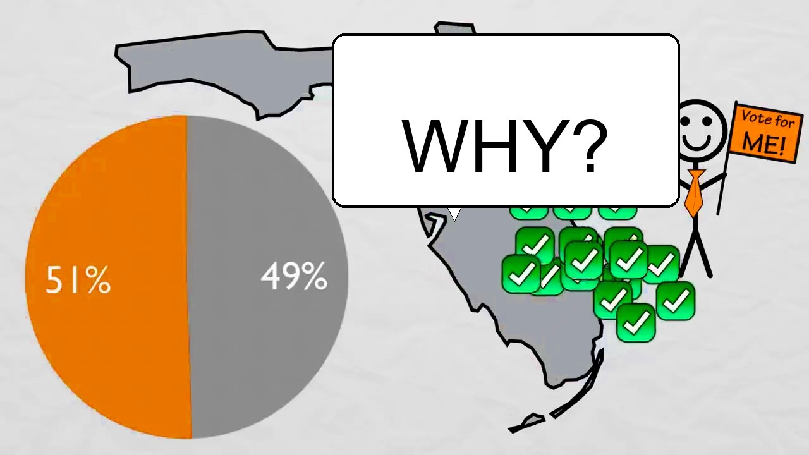

A running log of individual videos (YouTube essays, talks, podcasts) that have informed DOD discussion or been cited in a blog post or concept page. This tracks **specific videos**, not the creators or channels behind them — a creator gets a row here for each video referenced, not a dedicated page, unless their body of work warrants a full [organisation](../organisations/organisations.md) entry in its own right.

This is a citation log, not an endorsement list. Inclusion means a video was substantive enough to reference or respond to — not agreement with its argument.

| Date logged | Video | Creator / Channel | Topic | Referenced in | Thumbnail backup |
|---|---|---|---|---|---|
| 2026-06-26 | [We Need To Rethink Democracy](https://www.youtube.com/watch?v=W5JEJ_L_Zjg) | Andrewism | Anarchist critique of democracy as a category | [Anarchist critique of democracy](../blog/posts/2026-06-26-anarchist-critique-of-democracy.md) | [local copy](../assets/blog/2026-06-26-we-need-to-rethink-democracy-thumb.jpg) |

Thumbnails are saved locally under `docs/assets/blog/` (named `<date>-<slug>-thumb.jpg`) rather than hotlinked, so the reference survives if a video is taken down. Only the thumbnail is kept, not the video itself, and it's credited and linked back to the source.

## Watch list

Videos flagged as worth checking out but not (yet) discussed or cited in any DOD post. No "referenced in" link because there isn't one yet — these are bookmarks, not citations.

Add an entry with `util/add_video_reference.py` instead of editing this file by hand — it looks up the title/channel, downloads a local thumbnail to `docs/assets/blog/`, and appends both the table row and the thumbnail embed below:

```
python util/add_video_reference.py "https://www.youtube.com/watch?v=VIDEO_ID" --topic "One-line topic" --published 2026-06-18
```

`--topic` and `--published` are optional and will be asked for / left as `TBD` if omitted — fill in the date manually afterward if you don't have it handy.

Sorted newest-published first.

| Video published | Video | Creator / Channel | Topic |
|---|---|---|---|
| TBD | [You Would Be a Terrible Leader](https://www.youtube.com/watch?v=rStL7niR7gs) | CGP Grey | How would-be rulers must satisfy supporters to stay in power, and why that constrains even dictators |
| TBD | [You Can Win the Presidency With 22% of the Vote](https://www.youtube.com/watch?v=7wC42HgLA4k) | CGP Grey | How Electoral College math lets a candidate win with a minority of the popular vote |
| TBD | [The Voting System That Should Replace Every Election](https://www.youtube.com/watch?v=3Y3jE3B8HsE) | CGP Grey | Explains the Alternative Vote / STV and why it can outperform plurality voting |
| TBD | [Why Democracy Is Mathematically Impossible](https://www.youtube.com/watch?v=qf7ws2DF-zk) | Veritasium | Arrow's impossibility theorem — no voting system can satisfy all fairness criteria at once |
| 2020-11-03 | [Supreme Court Chaos — How to Fix Governmental Exploits with Warhammer 40K](https://www.youtube.com/watch?v=8TRyN0mpczQ) | Extra History (Extra Credits) | Exploits/loopholes in the US political system, framed as game-design bugs |
| 2020-11-02 | [Simulating alternate voting systems](https://www.youtube.com/watch?v=yhO6jfHPFQU) | Primer | Simulates how different voting systems (FPTP, approval, IRV, etc.) behave under the same electorate |
| 2018-06-26 | [The Rules of Society (Extra Politics, Part 4)](https://www.youtube.com/watch?v=gK1dZ67MLjY) | Extra History (Extra Credits) | Why political systems need stable, game-design-like rules to function |

If one of these gets discussed or cited in a post, move its row up into the main table above.

<a href="https://www.youtube.com/watch?v=rStL7niR7gs"></a>
<a href="https://www.youtube.com/watch?v=7wC42HgLA4k"></a>
<a href="https://www.youtube.com/watch?v=qf7ws2DF-zk"></a>
<a href="https://www.youtube.com/watch?v=8TRyN0mpczQ"></a>
<a href="https://www.youtube.com/watch?v=yhO6jfHPFQU"></a>
<a href="https://www.youtube.com/watch?v=gK1dZ67MLjY"></a>

## Possible future: a recommendation feed

Worth considering separately from this log: a lighter-weight way to surface interesting videos/articles to DOD members as they're found, rather than only retroactively logging things already cited in a post. That's closer to social-media sharing than to blogging or citation-tracking, and would need its own format (a Discord/mailing-list digest? a dated links page? something else?) rather than overloading this log or the blog. Noted here as a gap, not yet designed.
